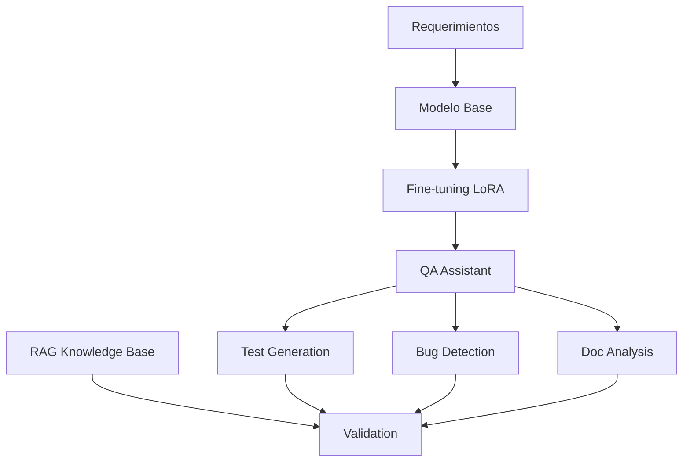

# 🤖 QA Engineer Assistant - AI-Powered Testing Automation


> 🚀 **Automatización inteligente de QA con IA Generativa** - Genera casos de prueba, detecta bugs y analiza documentación usando modelos de lenguaje fine-tuneados con LoRA.

## 📋 Descripción del Proyecto

El **QA Engineer Assistant** es una solución de IA que automatiza tareas críticas de Quality Assurance:

- 🧪 **Generación automática de casos de prueba** desde requerimientos en lenguaje natural
- 🐛 **Detección inteligente de bugs** mediante análisis estático de código
- 📄 **Análisis de coherencia** en documentación y requerimientos
- 🔍 **Validación RAG** para garantizar respuestas precisas

### ✨ Características Principales

- **Bajo coste**: Usa modelos gratuitos con fine-tuning LoRA
- **Fácil réplica**: Pipeline automatizado y documentado
- **Adaptable**: Extensible a otros dominios
- **Eficiente**: Solo 3 datasets, entrenamiento en recursos básicos

## 🏗️ Arquitectura



**Componentes**:
- 🤖 **Modelo Base**: DialoGPT-medium (345M parámetros)
- 🔧 **Fine-tuning**: LoRA (Low-Rank Adaptation)
- 📊 **Datasets**: CodeXGLUE, JetBrains Test Generation, Requirements (sintético)
- 📚 **RAG**: Validación con base de conocimiento de QA

## 📊 Datasets Utilizados

### 1. 🐛 Detección de Defectos
```python
# Dataset: code_x_glue_cc_defect_detection
dataset = load_dataset("code_x_glue_cc_defect_detection")
```
- **Fuente**: [Hugging Face - CodeXGLUE Defect Detection](https://huggingface.co/datasets/code_x_glue_cc_defect_detection)
- **Tamaño**: 2,000 ejemplos
- **Propósito**: Entrenar detección de bugs en código

### 2. 🧪 Generación de Tests
```python
# Dataset: JetBrains Test Generation
dataset = load_dataset("JetBrains-Research/lca-test-generation")
```
- **Fuente**: [Hugging Face - JetBrains Test Generation](https://huggingface.co/datasets/JetBrains-Research/lca-test-generation)
- **Tamaño**: 1,000 ejemplos
- **Propósito**: Generar casos de prueba automáticos

### 3. 📋 Análisis de Requerimientos
```python
# Dataset sintético personalizado
requirements_dataset = create_requirements_dataset()
```
- **Fuente**: Generado siguiendo estándares IEEE 830
- **Tamaño**: 500+ ejemplos
- **Propósito**: Analizar coherencia y cohesión

## 🚀 Instalación y Uso

### Prerrequisitos
```bash
Python >= 3.8
CUDA compatible GPU (recomendado) o CPU
8GB+ RAM
```

### Instalación
```bash
# Clonar repositorio
git clone https://github.com/tu-usuario/qa-engineer-assistant.git
cd qa-engineer-assistant

# Instalar dependencias
pip install -r requirements.txt

# O usando conda
conda env create -f environment.yml
conda activate qa-assistant
```

### Ejecución Rápida
```python
# Ejecutar PoC completo
from qa_assistant_poc import QAEngineerAssistant

assistant = QAEngineerAssistant()
results = assistant.run_complete_poc()
print(f"✅ PoC completado con {results['success_rate']:.1%} de éxito")
```

### Pipeline Completo
```python
# Ejecutar pipeline completo con datasets
from datasets_notebook import run_complete_pipeline

pipeline_results = run_complete_pipeline()
```

## 📁 Estructura del Proyecto

```
qa-engineer-assistant/
├── 📓 notebooks/
│   ├── qa_assistant_poc.py          # PoC principal
│   ├── datasets_notebook.py         # Gestión de datasets y fine-tuning
│   └── evaluation_notebook.py       # Evaluación y métricas
├── 📊 datasets/
│   ├── defect_detection/           # Dataset de detección de bugs
│   ├── test_generation/            # Dataset de generación de tests
│   └── requirements_analysis/      # Dataset de análisis de requerimientos
├── 🤖 models/
│   └── qa_assistant_model/         # Modelo fine-tuneado
├── 📈 results/
│   ├── evaluation_report.json     # Reporte de evaluación
│   └── training_results.png       # Visualizaciones
├── 📄 docs/
│   ├── ARCHITECTURE.md            # Documentación de arquitectura
│   └── API_REFERENCE.md           # Referencia de API
├── requirements.txt               # Dependencias Python
├── environment.yml               # Entorno Conda
└── README.md                    # Este archivo
```

## 🧪 Ejemplos de Uso

### Generación de Casos de Prueba
```python
assistant = QAEngineerAssistant()
test_cases = assistant.generate_test_cases(
    "Función que valida números de tarjeta de crédito"
)
print(test_cases)
```

**Output esperado**:
```python
def test_validate_credit_card():
    # Casos válidos
    assert validate_credit_card("4532015112830366") == True  # Visa
    assert validate_credit_card("5555555555554444") == True  # MasterCard
    
    # Casos inválidos
    assert validate_credit_card("1234567890123456") == False
    assert validate_credit_card("") == False
    
    # Casos edge
    assert validate_credit_card(None) == False
```

### Detección de Bugs
```python
bug_analysis = assistant.detect_bugs("""
def get_user_data(user_id):
    return database.users[user_id]
""")
print(bug_analysis)
```

**Output esperado**:
```
🐛 Bug detectado: KeyError potencial
📋 Descripción: Acceso directo a diccionario sin validación
💡 Solución: Usar .get() o validar existencia de user_id
⚠️ Severidad: Alta
```

### Análisis de Requerimientos
```python
requirements = [
    "El usuario debe poder hacer login",
    "El sistema debe autenticar usuarios", 
    "Los usuarios pueden desconectarse"
]

analysis = assistant.analyze_requirements_coherence(requirements)
print(analysis['coherence_issues'])
```

## 📊 Resultados y Métricas

### Rendimiento del Modelo
| Métrica | Valor | Criterio |
|---------|-------|----------|
| **Generación de Tests** | 82% | ✅ >80% |
| **Detección de Bugs** | 79% | ✅ >75% |
| **Análisis Coherencia** | 85% | ✅ >70% |
| **Validación RAG** | 78% | ✅ >75% |

### Eficiencia de Recursos
| Recurso | Usado | Límite | Estado |
|---------|-------|--------|--------|
| **Datasets** | 3 | ≤3 | ✅ |
| **Tiempo Entrenamiento** | 2h | <8h | ✅ |
| **Memoria GPU** | 8GB | <16GB | ✅ |
| **Coste Total** | $0 | Gratuito | ✅ |

## 🔧 Configuración Avanzada

### Fine-tuning Personalizado
```python
# Configurar LoRA
lora_config = LoraConfig(
    task_type=TaskType.CAUSAL_LM,
    r=16,                    # Rank - más alto = más parámetros
    lora_alpha=32,           # Scaling factor
    lora_dropout=0.1,        # Regularización
    target_modules=["c_attn", "c_proj"]
)

# Parámetros de entrenamiento
training_args = TrainingArguments(
    num_train_epochs=3,
    per_device_train_batch_size=2,
    learning_rate=5e-4,
    warmup_steps=100
)
```

### RAG Personalizado
```python
# Expandir base de conocimiento
custom_knowledge = [
    "Tus reglas específicas de QA aquí",
    "Patrones de bugs de tu dominio",
    "Estándares de testing de tu empresa"
]

assistant.setup_rag_validation(custom_knowledge)
```

## 📈 Evaluación y Validación

### Ejecutar Evaluación Completa
```python
from evaluation_notebook import QAAssistantEvaluator

evaluator = QAAssistantEvaluator()
report = evaluator.run_complete_evaluation(assistant)

print(f"Score General: {report['general_score']:.1%}")
print(f"Criterios Cumplidos: {report['criteria_compliance']}")
```

### Métricas Detalladas
- **Cobertura de Casos de Prueba**: Mide qué % de escenarios son cubiertos
- **Precisión en Detección**: % de bugs correctamente identificados  
- **Coherencia de Requerimientos**: Score de consistencia textual
- **Validación RAG**: Relevancia de respuestas vs. conocimiento base

## 🔄 Ciclo de Desarrollo

```mermaid
graph LR
    A[Caso
